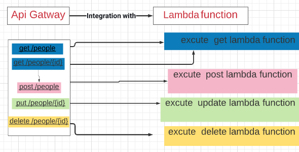

# serverless-api-

## What is the root URL to your API?
- ``https://qz1vgu5d4c.execute-api.us-east-1.amazonaws.com/``

## What are the routes?
|Method|Routes                    |
|------|--------------------------|
|GET   |/people                   |
|GET   |/people/{id}              |
|POST  |/people                   |
|UPDATE|/people/{id}              |
|DELETE|/people/{id}              |

## What inputs do they require?
|Method|input                     |
|------|--------------------------|
|GET   |nothing                   |
|GET   |nothing                   |
|POST  |JSON obj in body          |
|UPDATE|JSON obj in body          |
|DELETE|nothing                   |

## What output do they return?

|Method|OUTPUT                         |
|------|-------------------------------|
|GET   |RETURN all recored stored in DB|
|GET   |RETURN recored with match id   |
|POST  |RETURN posting obj             |
|UPDATE|RETURN updated obj             |
|DELETE|RETURN empty obj               |

# UML 
